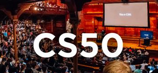

## CS50's Introduction to Computer Science - Web Track (2020)   
This repository will carry all the code developed alongside the lectures and problem sets of the CS50 Track from 2020: [HarvardX: CS50 - CS50's Introduction to Computer Science](https://www.edx.org/course/cs50s-introduction-to-computer-science)   
   
